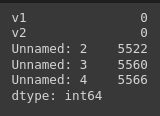

# Implementation-of-SVM-For-Spam-Mail-Detection

## AIM:
To write a program to implement the SVM For Spam Mail Detection.

## Equipments Required:
1. Hardware – PCs
2. Anaconda – Python 3.7 Installation / Jupyter notebook

## Algorithm
1. Detect encoding.
2. Import necessary files and read the csv file.
3. Feature and Target selection.
4. Train-Test split.
5. Create CountVectorizer Instance.
6. Initialize SVM Classifier and train SVM model.
7. Evaluate accuracy.

## Program:
```python
# Program to implement the SVM For Spam Mail Detection..
# Developed by   : Sam Israel D 
# RegisterNumber : 212222230128   
```
#### Detect encoding
```python
import chardet
file = 'spam.csv'
with open (file, 'rb') as rawdata:
    result = chardet.detect(rawdata.read(100000))
result
```
#### Import necessary libraries and read the csv file
```python
import pandas as pd
df = pd.read_csv('spam.csv', encoding = 'Windows-1252')
df.head()
```
#### Data Exploration
```python
df.info()
df.isnull().sum()
```
#### Feature and Target selection
```python
x = df['v1'].values
y = df['v2'].values
```
#### Train-Test Split
```python
from sklearn.model_selection import train_test_split
X_train, X_test, y_train, y_test = train_test_split(x, y, test_size = 0.2, random_state = 0)
```
#### Create CountVectorizer Instance
```python
from sklearn.feature_extraction.text import CountVectorizer
cv = CountVectorizer()
```
#### Fit and Transform Training Data
```python
X_train = cv.fit_transform(X_train)
X_test = cv.transform(X_test)
```
#### Initialize SVM Classifier and train SVM model
```python
from sklearn.svm import SVC
svc = SVC()
svc.fit(X_train, y_train)
y_pred = svc.predict(X_test)
y_pred
```
#### Evaluate Accuracy
```python
from sklearn.metrics import accuracy_score
accuracy = accuracy_score(y_test, y_pred)
accuracy
```
## Output:

#### Result output

#### data.head()

#### data.info()

#### data.isnull().sum()

#### Y_prediction value

#### Accuracy value


## Result:
Thus the program to implement the SVM For Spam Mail Detection is written and verified using python programming.